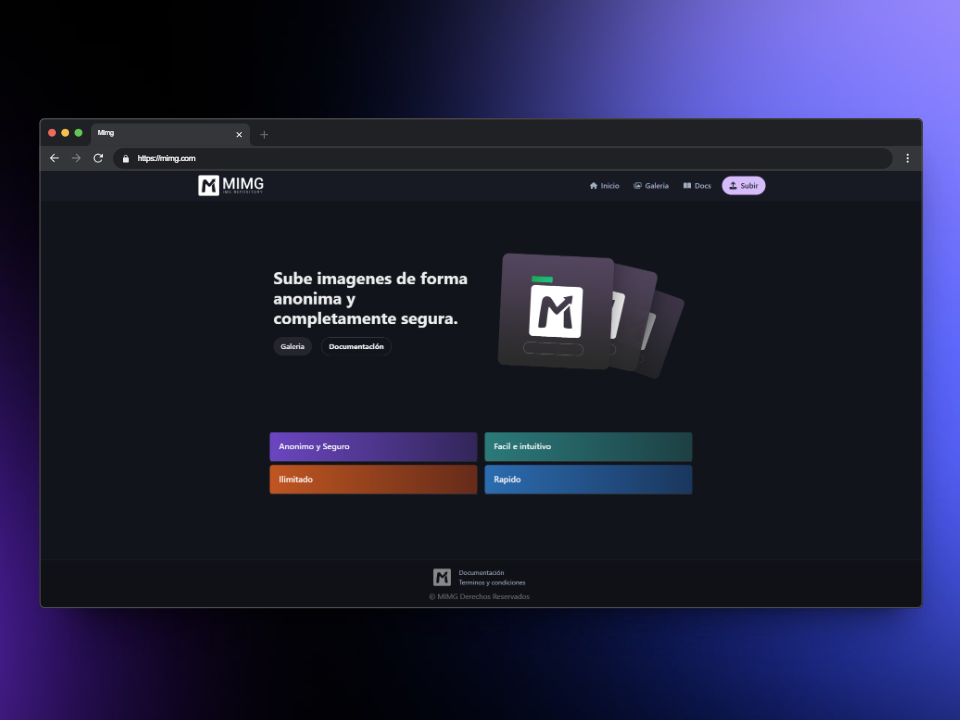

# :camera: MIMG  	

>Back-End    


>Front-End    


>Libreria de componentes / animaciones    


## :question: ¿Qué es MIMG? 
**MIMG** es una página web donde los usuarios pueden subir imágenes para compartirlas con otros, de manera anónima y sencilla. No es necesario crear una cuenta, simplemente sube tu imagen y será visible para todos. 


>[!CAUTION]
>Cualquier contenido inflamatorio o indebido sera eliminado


## :wrench: Instalación
Para instalar MIMG en tu computadora, sigue estos pasos:

1. **Clona el repositorio**:

    ```bash
    git clone https://github.com/akkkoxdianareal/Tpfinal.git
    ```

3. **Navegue entre las carpetas `client` y `server` del proyecto y luego instalar sus dependencias**:      

    - Server / API
        ```bash
        cd Server
        npm install
        ```

    - Cliente
        ```bash
        cd client
        npm install
        ```

4. **Iniciar el `backend / API`  ejecutando el siguiente comando**:

    ```bash
    cd server
    npm run dev
    ```

5. **Iniciar el `frontend`  ejecutando el siguiente comando**:

    ```bash
    cd client
    npm run dev
    ```

## :gear: ¿Cómo funciona?

### GET `/images`
Cuando se carga la página, se realiza una petición `GET` a la ruta `/images`, la cual devuelve un archivo `db-imagenes.json` que contiene la información de las imágenes almacenadas. Este archivo incluye detalles como el UUID, nombre de archivo, nombre asignado por el usuario y la fecha de subida.

 En la galería se mostrarán todas las imágenes, ordenadas de más nueva a más antigua.

### POST `/uploads`
Para subir una imagen:

1. El usuario selecciona un archivo de imagen y asigna un nombre a través de dos campos de entrada.
2. La imagen se comprime al 50% para optimizar el almacenamiento.
3. El archivo comprimido se sube al servidor mediante una petición `POST`.

El backend realiza las siguientes tareas:
- Asigna un nombre único al archivo para evitar conflictos.
- Registra la fecha de subida y genera un UUID para identificar la imagen.
- Verifica que la extensión de la imagen esté permitida. Si no lo está, devuelve un mensaje de error.
- Almacena la información en `db-imagenes.json` y guarda la imagen en la carpeta `uploads`.

## :technologist: Integrantes

- **Elias Ortiz** - Backend
- **Giuliano Zerda** - Frontend
- **Antonio Pineda Avila** - Documentación
